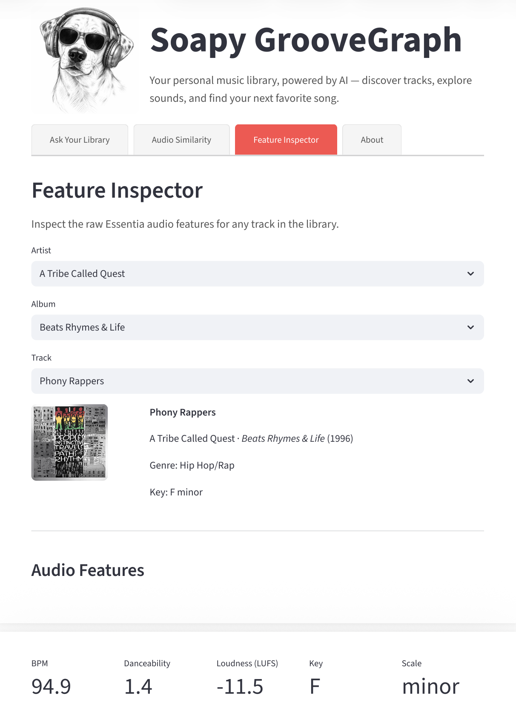
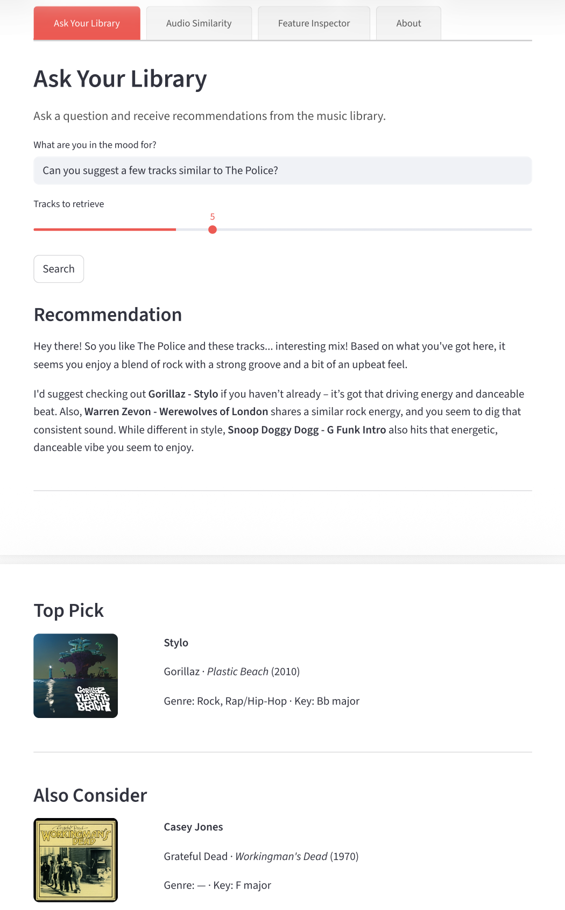
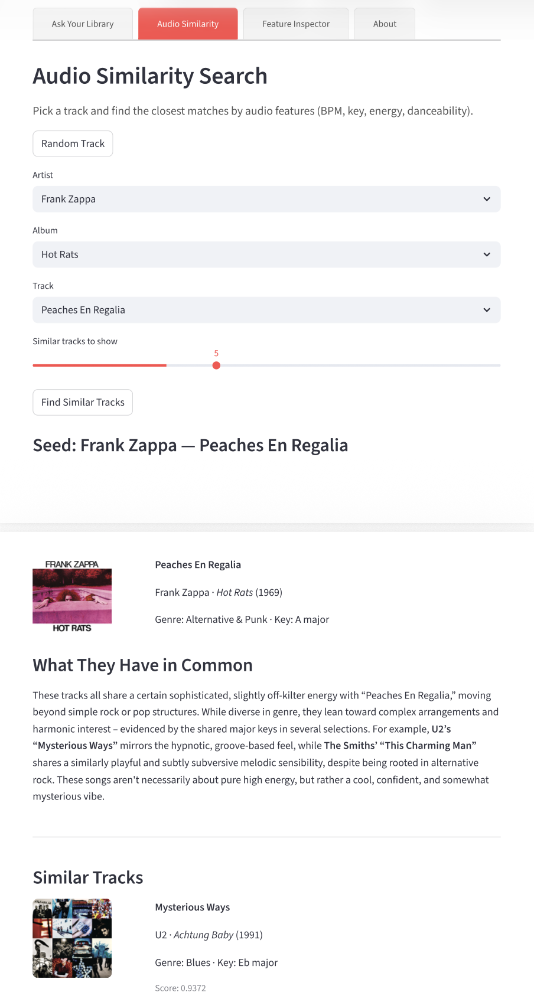

# Soapy GrooveGraph

AI-powered music discovery over a personal iTunes library. Ask natural language questions — *"slow jazzy late night music"*, *"upbeat tracks to wake up to"* — and get cited, LLM-generated answers with album art, powered entirely by local models and audio features.

> SGG knows *your* library. Every obscure album you imported from a CD in 2003. Every artist no one else is familiar with. SGG lets you ask questions about your own music collection and surfaces tracks that were forgotten or buried.

→ [Screenshots](#screenshots)

---

## What It Does

- **Ask Your Library** — natural language RAG over 9,254 track embeddings; answers generated by `gemma3:27b` with source citations and album art
- **Audio Similarity Search** — pick any track and find the closest matches by audio fingerprint using 12-dim z-scored vectors (BPM, key, energy, danceability, and more)
- **Feature Inspector** — select any track and view its raw Essentia audio feature values

---

## Design Principles

- **Local-first** — all models, databases, and compute run on your machine; no cloud services for core functionality
- **Distinct pipeline stages** — feature extraction, data transformation, vector storage, and UI are discrete stages with clean handoffs
- **Setup vs. runtime** — setup stages (1–5) run once; only Stage 6 executes on every user query
- **Identifier consistency** — `file_hash` is the primary key carried through every stage of the pipeline

---

## Stack

| Layer | Tool | Purpose |
|---|---|---|
| Audio extraction | Essentia (Docker) | Extract audio features and metadata from iTunes audio files |
| Data transformation | dbt-core + DuckDB | Stage, deduplicate, and build the audio feature mart |
| Vector store | Qdrant | Store and query audio and text embedding vectors |
| Embeddings | Ollama — `nomic-embed-text` | Generate 768-dim text embeddings from track descriptions |
| LLM | Ollama — `gemma3:27b` | Generate cited natural language answers from retrieved context |
| Album art | iTunes Search API (cached) | Resolve album artwork URLs — cached locally, never called at query time |
| UI | Streamlit | Interactive dashboard — RAG query, audio similarity, feature inspector |

---

## Pipeline

SGG is a linear, stage-gated pipeline. Stages 1–5 are one-time setup; Stage 6 runs on every user query.

```
iTunes Audio Library (~9,254 files)
        |
        ▼
Stage 1 — File Manifest
        scripts/es_select_files.py → data/file_lists/es_targets.txt
        |
        ▼
Stage 2 — Audio Feature Extraction
        Essentia (Docker, temporary) → data/raw/essentia/extraction/*.json
        |
        ▼
Stage 3 — Data Transformation
        scripts/es_flatten_features.py → Parquet
        dbt-core + DuckDB → fct_audio_vector_v1
        |
        |——→ Stage 4 — Audio Vectors
        |           scripts/qdrant_upsert_audio.py
        |           → Qdrant: sgg_audio_v1 (12-dim, cosine)
        |
        └——→ Stage 5 — Text Embeddings
                    scripts/sgg_text_embed.py
                    Ollama: nomic-embed-text
                    → Qdrant: sgg_text_v1 (768-dim, cosine)

                            |
                            ▼
                    Stage 6 — Runtime (Streamlit Dashboard)
                            User query
                            → nomic-embed-text (query embedding)
                            → Qdrant sgg_text_v1 (retrieval)
                            → gemma3:27b (answer generation)
                            → Streamlit UI (display + album art)
```

---

## Quick Start

**Prerequisites:** Docker, Python 3.10+, [Ollama](https://ollama.com) with `gemma3:27b` and `nomic-embed-text` pulled

**1. Setup**
```bash
python -m venv venv && source venv/bin/activate
pip install -r requirements.txt
cp .env.example .env   # edit with your paths
```

**2. Launch everything**
```bash
make dashboard   # starts Docker (Qdrant + Postgres), Ollama, and Streamlit
```

**3. Open the dashboard**

Navigate to `http://localhost:8501`

---

## Configuration

All service endpoints are read from `.env` at startup — never hardcoded. Key variables:

| Variable | Default | Purpose |
|---|---|---|
| `QDRANT_URL` | `http://localhost:6335` | Qdrant REST endpoint |
| `OLLAMA_BASE_URL_HOST` | `http://localhost:11434` | Ollama endpoint |
| `OLLAMA_CHAT_MODEL` | `gemma3:27b` | LLM for answer generation |
| `OLLAMA_EMBED_MODEL` | `nomic-embed-text` | Embedding model |

---

## What's Built

| Component | Detail |
|---|---|
| Audio feature extraction | 9,254 tracks from iTunes library via Essentia |
| dbt pipeline | `stg_essentia_features → im_essentia_features_unique → fct_audio_vector_v1` |
| Audio similarity | `sgg_audio_v1` — 12-dim z-scored vectors, cosine similarity |
| Text RAG | `sgg_text_v1` — 768-dim embeddings, cited answers via `gemma3:27b` |
| Album art | 100% coverage across 999 artist/album pairs (iTunes API + gap-fill) |
| Streamlit UI | RAG panel, similarity search, feature inspector |

---

## Docs

| File | Purpose |
|---|---|
| `docs/overview.md` | Project background, stack, data flow, folder structure |
| `docs/infra.md` | Ports, services, config reference, health checks |
| `docs/sgg_technical_reference.pdf` | Full technical reference — architecture, component deep dives, data reference, operations |

---

## Key Conventions

- `file_hash` is the primary key across all Essentia-derived data — Parquet, DuckDB, and Qdrant
- Two Qdrant collections: `sgg_audio_v1` (12-dim numeric) and `sgg_text_v1` (768-dim text)
- Parquet-first storage → DuckDB (dbt dev)
- Archived scripts and dbt models live in `z_archive/` folders — preserved but not in the active pipeline

---

## Screenshots

### Feature Inspector — inspect raw Essentia audio features for any track


<br>

### Ask Your Library — natural language RAG with LLM-generated answer and album art


<br>

### Audio Similarity Search — find tracks that sound like a seed track by audio fingerprint

